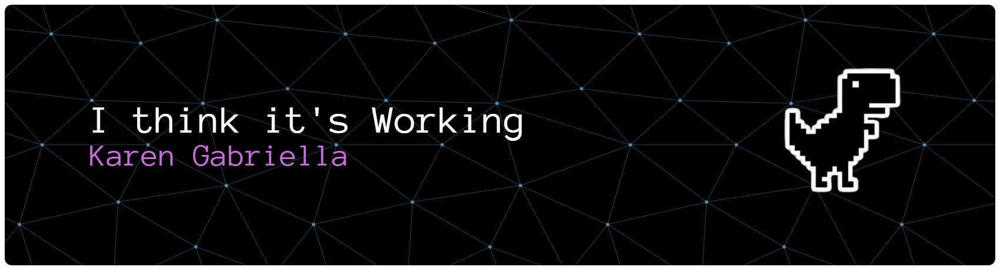

# Karen Gabriella Rodrigues

### Desenvolvedora de Software • Automação • Backend • Agentes de IA

---

## Sobre mim

Ohyoo! Sou uma desenvolvedora de software com foco em **automação, backend e inteligência artificial aplicada**.

Minha atuação gira em torno da construção de sistemas que **reduzem fricção operacional**, conectando serviços, automatizando processos e criando fluxos inteligentes.

Atualmente trabalho com **automação em Python e integração de sistemas em ambiente corporativo**, desenvolvendo soluções que orquestram serviços, automatizam tarefas e criam bases para aplicações com agentes de IA.

---

# Tecnologias

### Automação & Backend

 

### Automação

 

### Inteligência Artificial

 

### Tecnologias em contexto

---

# Linguagens mais utilizadas

---

# Projetos e iniciativas

### Redvus

Sistema inteligente voltado para **localização de pessoas desaparecidas**, utilizando automação e inteligência artificial.

---

# Direção de aprendizado

Atualmente aprofundando estudos em:

* agentes baseados em LLM
* arquiteturas de IA aplicada
* automação inteligente
* integração de sistemas com IA

---

# Conecte-se comigo

---

### Filosofia

Tecnologia se torna verdadeiramente significativa quando ajuda a resolver **problemas reais**.

